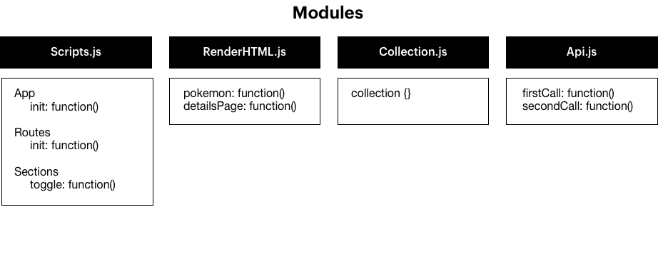
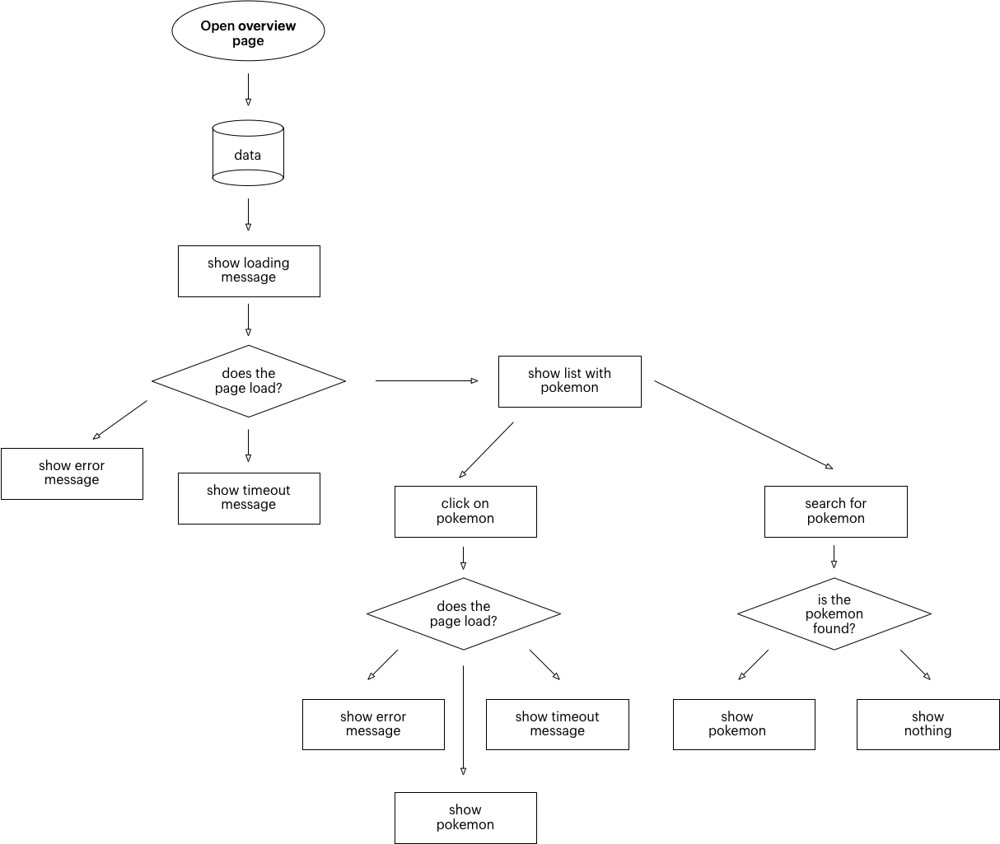
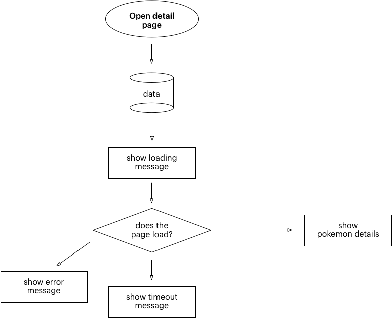

Link to the live [demo](https://nourbayard.github.io/wafs/app)

# Introduction
For the course ‘Web App From Scratch’, I made a single web application Pokédex which shows all the Pokemons of the first generation. For this, I used [PokéApi](https://www.pokeapi.co/).

## What is the PokéApi?
PokéApi is an API that consists of all sorts of information of all Pokémon. According to their website:

> This website provides a RESTful API interface to highly detailed objects built from thousands of lines of data related to Pokémon. We specifically cover the video game franchise, though we'd like to cover the card game too. Using this website, you can consume information on Pokémon, their moves, abilities, types, egg groups and much much more.

## The Process

This assignment was as a difficult challenge for me. Since I’m not very good at Javascript, I had to ask for a lot of help from other students to set up the basic structure and get the basic functionalities working. After some time, I started understanding more what my code meant and what it was doing. When I finished most of the functionalities, I drew the diagrams (shown beneath).

## The Pokédex features

- PokéAPI
- Routie.js to navigate through the pages
- Overview with all the Pokémon of the first generation
- (Loader om feedback te geven aan de gebruiker dat de API geladen wordt)
- (Sorteer optie om de data te sorteren op volgorde van rank)

## Wishlist
- Name AND picture on the overview pages
- Style it like a Pokédex

## Diagrams

### Actor Diagram

> This Actor diagram shows what functions triggers something else in the code.

> This diagram shows the flow of the overview page.

> This diagram shows the flow of the detail page.

#### Kudos
Special thanks to [Vincent](https://github.com/vincentkempers), [Mo](https://github.com/moniac/), [Kevin](https://github.com/kyunwang/), [Sam](https://github.com/Sam-Guliker/) and [Servin](https://github.com/servinlp). 🙏🏼
